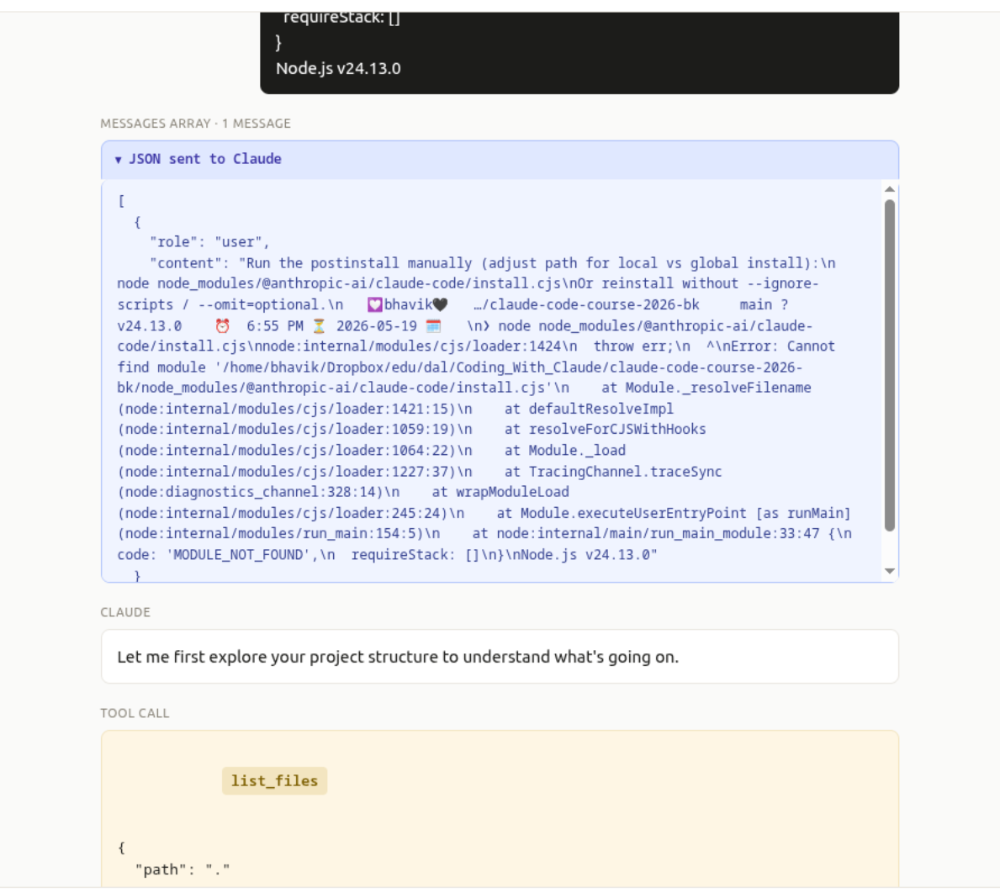
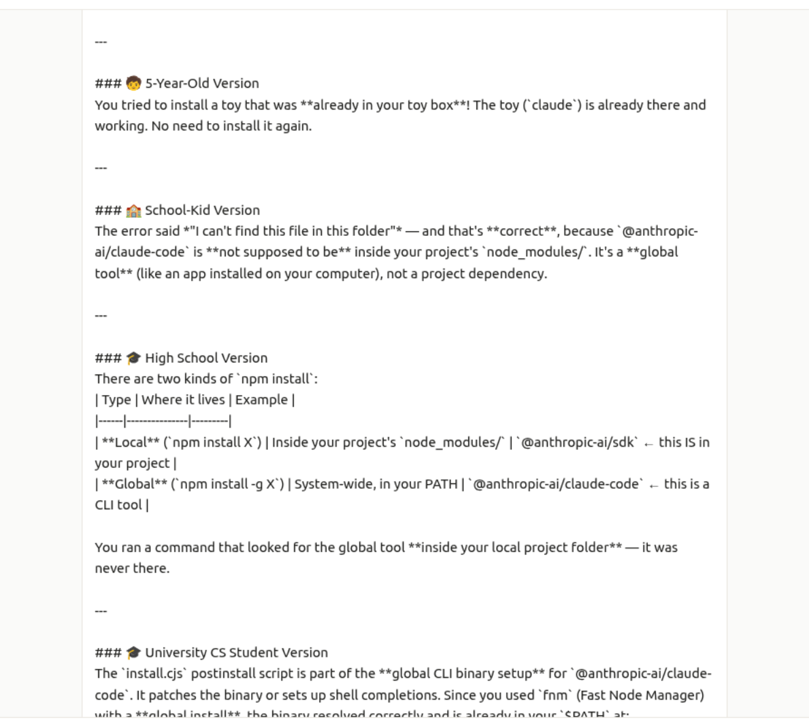

# Week 3 — Before/After Prompt Trace

**Context:** A real prompt from my own history. I was trying to install the Claude
Code CLI on Linux with **pnpm**, and it kept failing with a `MODULE_NOT_FOUND` /
"native binary not installed" error. My first instinct was to paste the raw error
into devlens with no explanation. When that gave a generic answer, I refined the
prompt by adding the one fact that mattered — that I install with pnpm.

Both versions were tested live in **devlens**; the screenshots below are from that
real session.

---

## 1. Original prompt (BEFORE)

I pasted the raw error dump — no goal, no environment, no question:

```text
node node_modules/@anthropic-ai/claude-code/install.cjs
node:internal/modules/cjs/loader:1424
  throw err;
  ^
Error: Cannot find module '/home/bhavik/.../@anthropic-ai/claude-code/install.cjs'
    at Module._resolveFilename (node:internal/modules/cjs/loader:1421:15)
  code: 'MODULE_NOT_FOUND',
  requireStack: []
}
Node.js v24.13.0
```

### What devlens did (BEFORE)

devlens explored the project with its tools — `list_files`, then `run_command`
(which showed only `sdk`, not `claude-code`, inside `@anthropic-ai/`), then
`read_file` on `package.json`:




**Result:** With no mention of pnpm, devlens **guessed** at the most common cause —
that `@anthropic-ai/claude-code` is "a global CLI tool, not a project dependency" —
and recommended `npm install -g @anthropic-ai/claude-code`. That was unhelpful for
me: I had *already* installed it globally **with pnpm**, which is exactly where the
error came from. The answer addressed a generic case, not mine.

---

## 2. Rewritten prompt (AFTER)

In the follow-up prompts I added the missing context — my environment, and
specifically that I install with **pnpm** — and asked a direct question:

```text
I am installing the Claude Code CLI on Linux (Node v24.13.0, pnpm v10.28.0).
`pnpm add -g @anthropic-ai/claude-code` says "Already up to date", but `claude`
fails with "native binary not installed" (postinstall did not run / optional
dependency not downloaded). Given that I install with pnpm, what is the root
cause and how do I fix it?
```

### What devlens did (AFTER)

Now devlens addressed the **pnpm-specific** root cause and gave a concrete,
pnpm-aware fix — set up pnpm's global PATH, then reinstall so the postinstall runs:




**Result:** devlens stopped guessing and explained *why pnpm specifically* breaks
the "optionalDependencies + postinstall native binary" pattern (pnpm omits optional
deps and uses a non-hoisted, symlinked `node_modules`, so the install script's
`require()` paths fail), then gave steps that actually fit my setup.

---

## 3. What I changed and why it worked

> I replaced a context-free error dump with a prompt that named my environment —
> specifically that I install with pnpm — because pnpm blocks postinstall scripts
> and omits optional dependencies by default, and that single fact is what let
> devlens diagnose the real cause instead of guessing among the many things that
> can throw `MODULE_NOT_FOUND`.
